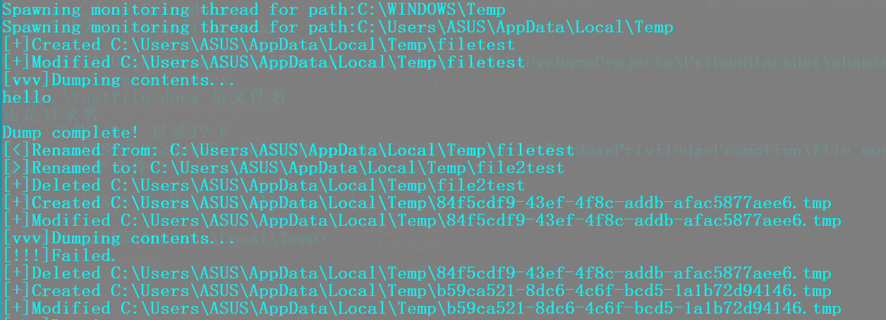
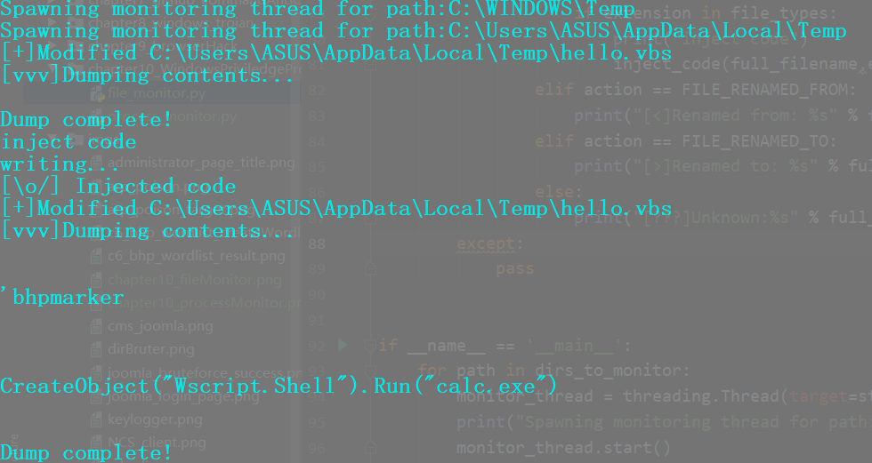
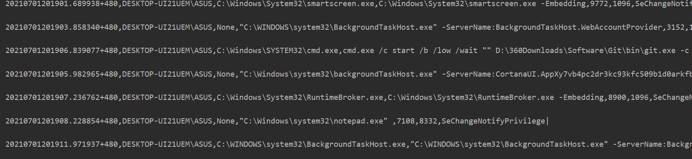

**file_monitor.py**
+ monitor the change of temp dir,and dump the content of file modified.

+ monitor the files in the directory.When created and modified,inject code to the files.

**process_monitor.py**
+ monitor the processes created and output their information.
