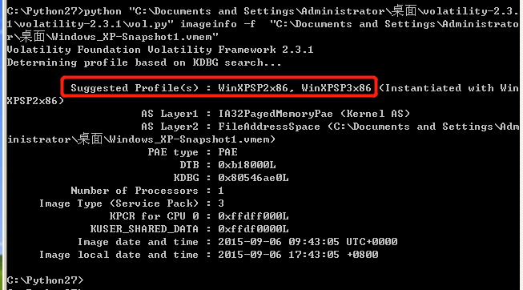
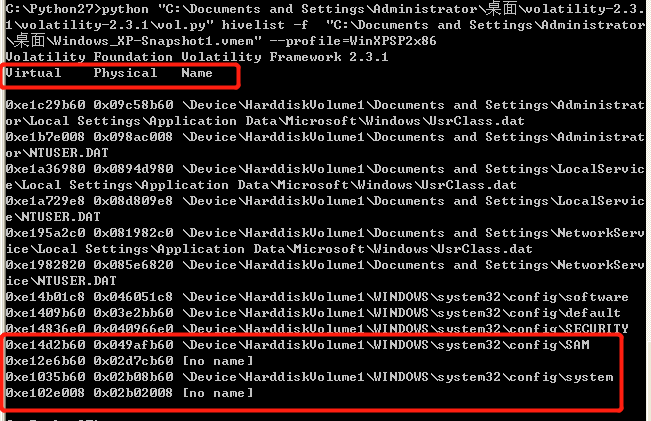
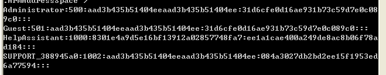
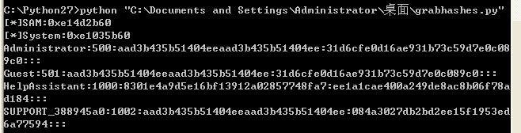
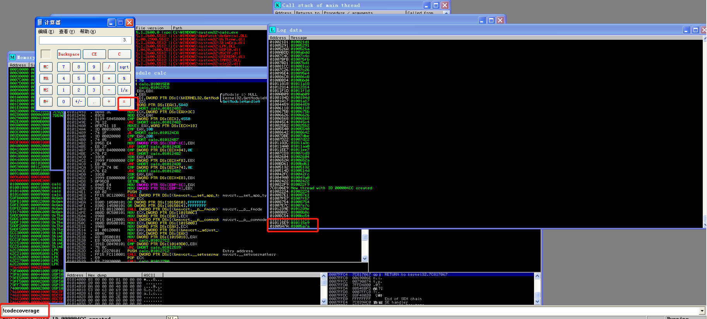
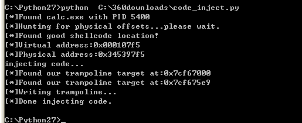

**grabhashes.py**
using Volatility plugins "imageinfo","hivelist","hashdump" to locate registry system and SAM offset,and 
dump the hashes value.
+ lookup system info,especially the Profiles field.

+ using plugin hivelist to get the offset registry key SAM and system.

+ dump the corresponding hashes value.

+ use a python script instead.

**codecoverage.py**
+ In Immunity Debugger,open program calc.exe to analyze.Through setting disposable breakpoint for each function 
in program,we get the address of equal(=) function.

**code_inject.py**
+ In vmware image,find the calc.exe process and get the address space and memory page.Then find the slack space 
to inject shellcode,and write the jmp instruction at address after equal function.
+ Unfortunately,after modified and reload the image,the shellcode can not be executed,somwhow. 
