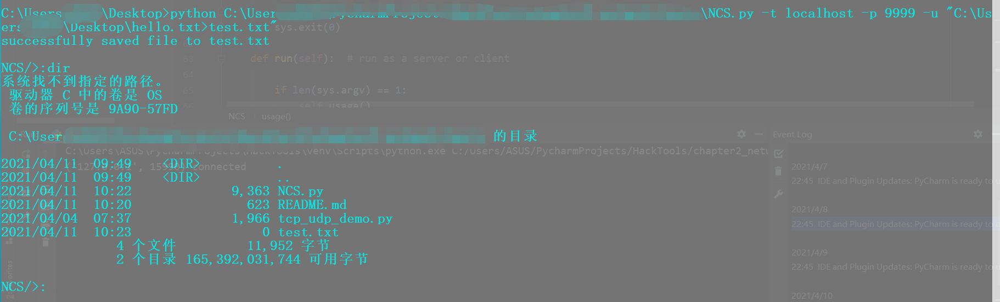
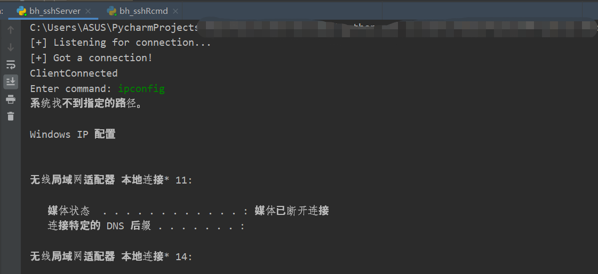
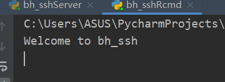

**NCS.py**
+ As server,it can decide what functions to provide,sunch as file upload,execute command and return a shell;
If the client use the function server not provide,something may go wrong.
+ As client,it can upload file to server and wait for a shell starting with NCS/>.Also it can start a runnable program at client side,but it's meaningless.
+ try -h,--help to get help. 

For example,server and client can starts with:
```shell script
# server
python ./NCS.py -l -p 9999 -c -u hello.txt>test.txt
# client
python ./NCS.py -t localhost -p 9999 -u hello.txt>test.txt
```
The client will run like this:


Note:For server,just in the example,the "hello.txt" is count for little,like a placeholder,just make sure the "test.txt" is actually the path you want to save to.
Similarly,for the client,just care about the "hello.txt".

**bh_sshRcmd.py & bh_sshServer.py**
ssh server waits for the ssh client to connect,send the command to client;Client returns the result of command executed to server;
Client can be quickly set up when the machine has python and paramiko module but ssh service.
Run just like:
+ Server:python bh_sshServer.py 127.0.0.1 22

+ Client:python bh_sshRcmd.py



