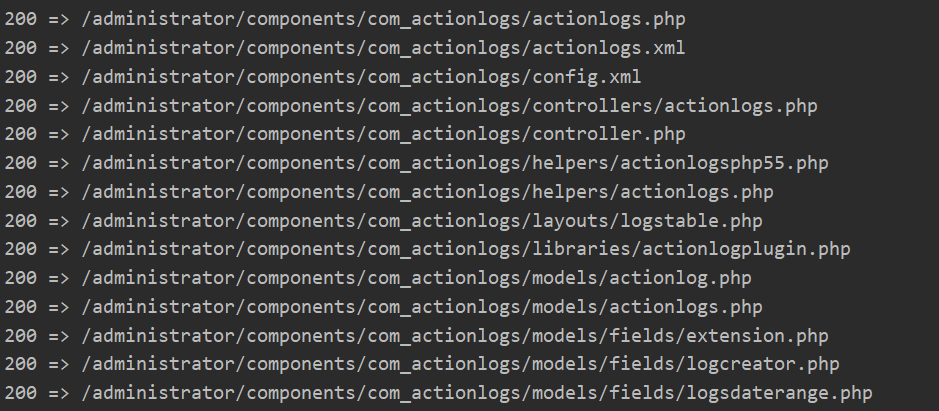
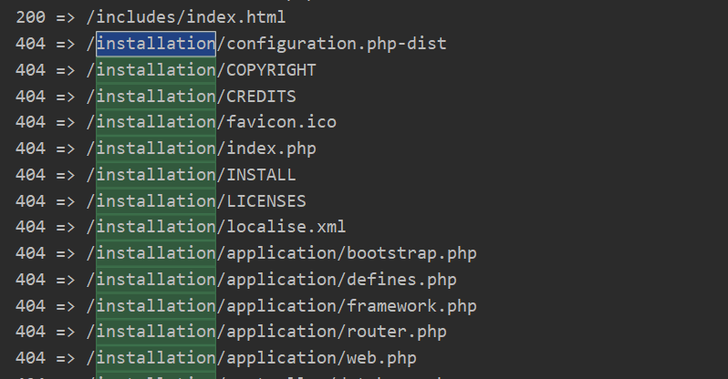
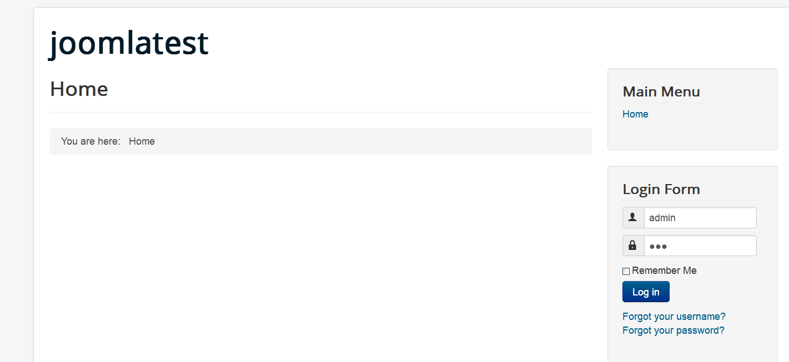
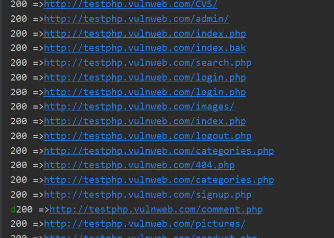
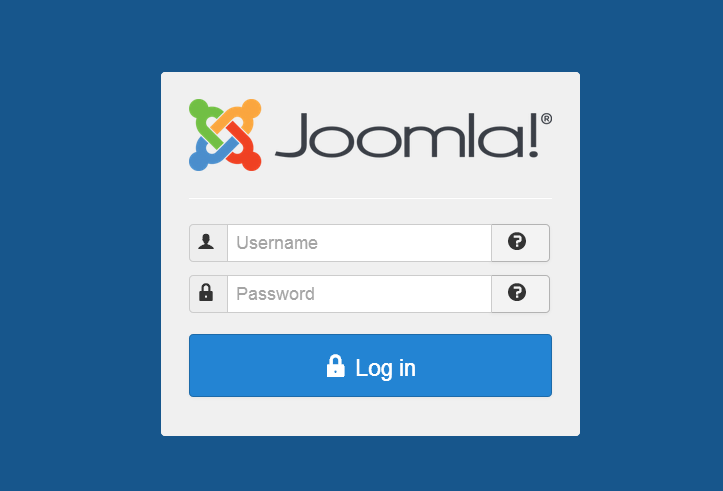
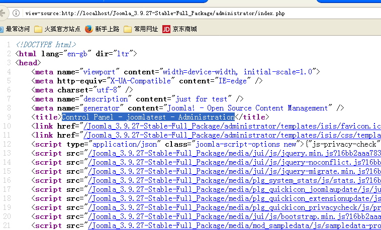
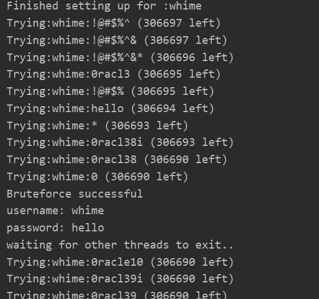

**web_app_mapper.py**
+ install and configure CMS joomla in vm host 192.168.29.128,and after delete installation directory
+ download and decompress Joomla_3.9.27-Stable-Full_Package.zip in localhost
+ run script in localhost to test the CMS according to the content of joomla package
+ all file can be accessed except files under directory "installation",returning code 404

**content_bruter**

using Dictionary all.txt to perform dirBruter.

**joomla_kill.py**
+ It is a script that using wordlist to bruteforce administrator login page of joomla CMS.
+ It saves the cookies,parse the hidden form element,and extract some key-value especial a random token
+ with a given username and a wordlist of password,send a post request and verify whether the password is correct.

That's all. 

